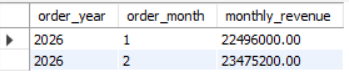
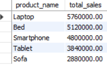
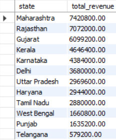

# 🛒 E-Commerce Business Intelligence (SQL)

## 📌 Project Overview
This project demonstrates an end-to-end SQL-based Business Intelligence solution for an E-Commerce system.  
The objective is to design a relational database, generate business insights using advanced SQL queries, and implement performance optimization techniques.

The project covers database design, data modeling, analytical queries, views, stored procedures, triggers, and indexing.

---

## 🏗 Database Design

The database retail_orders_db consists of four core tables:

- *customers* – Customer information (state, segment)
- *products* – Product catalog (category, price)
- *orders* – Order-level transaction details
- *order_details* – Line-level sales and profit data

### 🔗 Relationships
- One Customer → Many Orders
- One Order → Many Order Details
- One Product → Many Order Details

Primary Keys and Foreign Keys are implemented to maintain referential integrity.

---

## 📊 Business Problems Solved

The following business insights were generated:

- ✅ Total Revenue & Total Profit
- ✅ Revenue by Customer
- ✅ Revenue by Product Category
- ✅ Customer Lifetime Value (CLV)
- ✅ Top 5 Revenue Generating Products
- ✅ Monthly Revenue Trend
- ✅ State-wise Revenue & Profit Margin
- ✅ Segment-wise Performance
- ✅ Category Performance by Segment
- ✅ Above-Average Revenue Customers (Subquery Analysis)

---

## 📈 Views Created

To support reusable reporting:

- customer_revenue_view
- state_wise_profit_margin
- monthly_revenue_view
- product_performance_view
- segment_performance_view

These views simplify BI reporting and dashboard integration.

---

## ⚙ Stored Procedures

- *GetStatePerformance()*  
  Returns revenue, profit, and margin for a given state.

- *GetOverallPerformance()*  
  Returns overall revenue, total profit, and overall profit margin.

---

## 🔐 Trigger Implementation

A validation trigger check_negative_profit was created to:

- Prevent insertion of negative profit values
- Enforce business data integrity rules

---

## 🚀 Performance Optimization

- Created index on customers.state
- Created index on orders.customer_id
- Used proper JOIN conditions and aggregations
- Applied GROUP BY, ORDER BY, and LIMIT for optimized reporting

---

## 🛠 Technologies Used

- MySQL
- SQL (DDL, DML, DQL)
- Views
- Stored Procedures
- Triggers
- Indexing
- Subqueries

---

## 🎯 Key Skills Demonstrated

- Relational Database Design
- Business Intelligence Query Writing
- Revenue & Profit Analysis
- Performance Optimization
- Data Integrity Enforcement
- Advanced SQL Concepts

---

## 📌 Conclusion

This project demonstrates practical SQL skills required for Data Analyst and SQL Developer roles.  
It simulates real-world E-Commerce business reporting and performance analysis using structured SQL solutions.

---

# 📊 Key Business Insights

---

## 1️⃣ Overall Business KPI

### ❓ Business Question:
What is the total revenue, total profit, and overall profit margin?

### 💻 SQL Query:

sql
SELECT 
    SUM(od.sales) AS total_revenue,
    SUM(od.profit) AS total_profit,
    ROUND((SUM(od.profit)/SUM(od.sales))*100,2) AS profit_margin_pct
FROM order_details od;

### 📷 Output Screenshot:

---

## 2️⃣ Monthly Revenue Trend

### ❓ Business Question:
How does revenue change month by month?

### 💻 SQL Query:

sql
SELECT 
    YEAR(o.order_date) AS order_year,
    MONTH(o.order_date) AS order_month,
    SUM(od.sales) AS monthly_revenue
FROM orders o
JOIN order_details od 
ON o.order_id = od.order_id
GROUP BY order_year, order_month
ORDER BY order_year, order_month;

### 📷 Output Screenshot:

---

## 3️⃣ Top 5 Products by Revenue

### ❓ Business Question:
Which 5 products generate the highest revenue?

### 💻 SQL Query:

sql
SELECT 
    p.product_name,
    SUM(od.sales) AS total_sales
FROM products p
JOIN order_details od 
ON p.product_id = od.product_id
GROUP BY p.product_name
ORDER BY total_sales DESC
LIMIT 5;

### 📷 Output Screenshot:

---

## 4️⃣ State Wise Revenue

### ❓ Business Question:
Which states generate the highest revenue?

### 💻 SQL Query:

sql
SELECT 
    c.state,
    SUM(od.sales) AS total_revenue
FROM customers c
JOIN orders o
    ON c.customer_id = o.customer_id
JOIN order_details od
    ON o.order_id = od.order_id
GROUP BY c.state
ORDER BY total_revenue DESC;

### 📷 Output Screenshot:

---

## 5️⃣ Segment & Category Performance

### ❓ Business Question:
How does each customer segment perform across product categories?

### 💻 SQL Query:

sql
SELECT 
    c.segment,
    p.category,
    SUM(od.sales) AS total_revenue
FROM customers c
JOIN orders o
    ON c.customer_id = o.customer_id
JOIN order_details od
    ON o.order_id = od.order_id
JOIN products p
    ON od.product_id = p.product_id
GROUP BY c.segment, p.category
ORDER BY c.segment, total_revenue DESC;

### 📷 Output Screenshot:

---

# 🧠 Skills Demonstrated

- Advanced SQL Query Writing
- JOIN Operations
- GROUP BY & Aggregations
- Revenue & Profit Analysis
- Business KPI Calculation
- Real-world Business Intelligence Thinking

---

# 🏁 Conclusion

This project simulates a real-world E-Commerce BI environment where SQL is used to generate revenue insights, performance analysis, and business KPIs for decision making.

### 👤 Author
Vishal Shenkre  
SQL | Python | Power BI | Data Analytics
